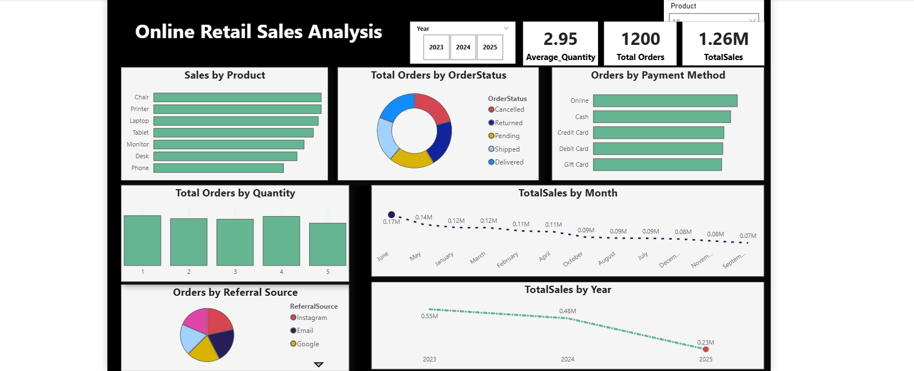

# 🛒 E-Commerce Sales Exploratory Data Analysis (EDA)

## 📌 Project Overview

This project performs a full *Exploratory Data Analysis (EDA)* 
on a real-world e-commerce dataset of *1,200 customer orders*. 
Using Power BI and DAX, I uncovered hidden patterns in sales 
performance, customer behavior, and operational efficiency — 
transforming raw transactional data into actionable business 
intelligence.

---

## ❗ Business Problem

> "Without data, you're just a person with an opinion."

Businesses generate massive volumes of transactional data daily. 
Without structured analysis, critical insights about product 
performance, customer behavior, and revenue trends remain buried. 
This project answers three core business questions:

- 📦 *Which products drive the most revenue?*
- 👥 *How do customers find and pay for their orders?*
- ⚠️ *Why is the cancellation/return rate alarmingly high?*

---

## 📂 Dataset Information

| Column | Description |
|---|---|
| OrderID | Unique order identifier |
| Date | Transaction date (Jan 2023 – Jun 2025) |
| Product | 7 product categories |
| Quantity | Units purchased (1–5) |
| UnitPrice | Price per unit ($11 – $699) |
| TotalPrice | Order revenue |
| PaymentMethod | Online, Cash, Credit/Debit Card, Gift Card |
| OrderStatus | Delivered, Shipped, Pending, Returned, Cancelled |
| ReferralSource | Instagram, Email, Google, Facebook, Referral |
| CouponCode | Discount code applied (if any) |

*1,200 rows | 14 columns | 3 years of data*

---

## 🛠️ Tools Used

- *Power BI* — Interactive dashboard & visualizations
- *DAX* — Custom measures and calculated columns
- *Excel* — Data cleaning and preparation
- *EDA techniques* — Statistical analysis & pattern recognition

---

## 📊 Analysis Performed

### 💰 Sales Performance
- Total revenue by product, month, and year
- Average order value trends
- Price distribution analysis

### 👤 Customer Behavior
- Orders by payment method
- Customer acquisition by referral source
- Purchase quantity patterns

### ⚙️ Operational Analysis
- Order status breakdown
- Cancellation and return rate analysis
- Fulfillment trend monitoring

---

## 🔑 Key Findings

> 💡 These are the most critical insights from the analysis:

- 🚨 *41% of all orders were either cancelled or returned* — 
a major operational red flag requiring immediate investigation
- 📱 *Instagram is the top acquisition channel* (259 orders), 
slightly ahead of Email (250) and Google (241)
- 💳 *Payment methods are evenly distributed* (~20% each), 
suggesting no strong customer preference
- 📈 *TotalPrice is right-skewed* — the mean ($1,054) is 
significantly higher than the median ($824), driven by 
high-quantity bulk orders
- 🖨️ *Printers lead in order volume* (181 orders) but 
Phones trail behind (156), indicating a potential 
marketing opportunity

---

## 📸 Dashboard Preview

---

## 💡 Recommendations

Based on the analysis:

1. *Investigate cancellations* — 41% non-completion rate 
needs root cause analysis
2. *Double down on Instagram* — highest acquisition channel 
deserves more marketing budget
3. *Target Phone category* — lowest order volume despite 
competitive pricing

---

## 👤 Author

*Stanley Obi*
Aspiring Data Analyst | Power BI Enthusiast

